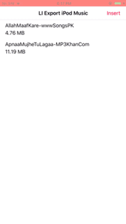

# Export-iPod-music-library-swift

I have create small music player app for iOS which will import audio files from iPod Music Library and save it to your document directory. So later you can use that music file as per your requirements within you application.

[Here](https://www.logisticinfotech.com/blog/import-audio-from-ipod-music-library-swift/) you will find step by step guide to to accomplish this.

